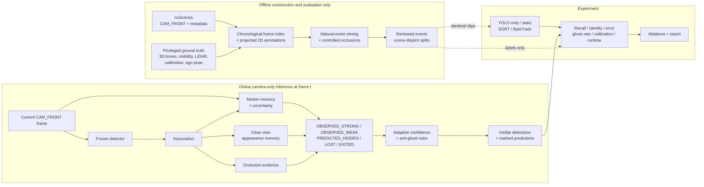
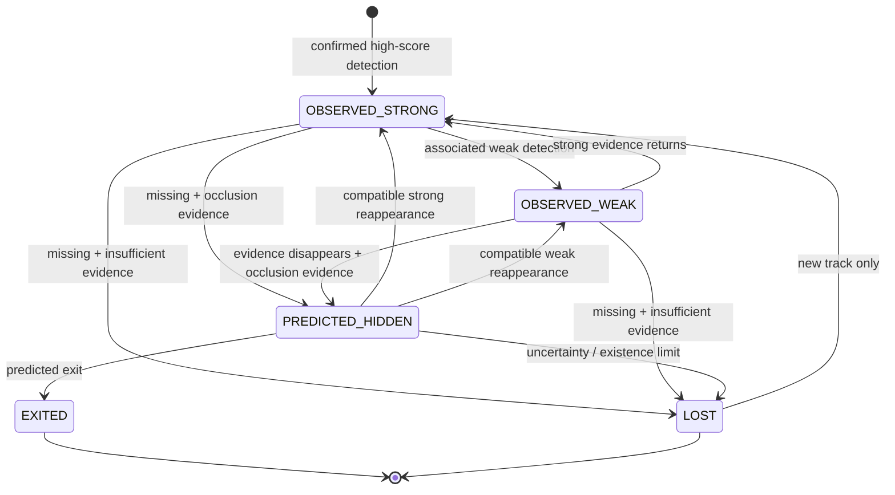

# OATM Implementation Plan

This is the durable handoff for implementing **Occlusion-Adaptive Temporal
Memory (OATM)**. It translates `METHODOLOGY.md` into ordered, testable work that
can resume without reconstructing earlier decisions.

## Potential pipeline



The solid online path is what OATM may use at runtime. Dotted paths carry
experiment data only. LiDAR, 3D annotations, visibility, and recorded ego pose
must never leak into the primary camera-only prediction path.

## 1. Scope and decisions

### Minimum viable study

Use:

- nuScenes `CAM_FRONT`.
- Cars and pedestrians first; add trucks/buses after class mapping is stable.
- A frozen YOLO-family detector matching earlier experiments where practical.
- A ByteTrack-style strong/weak-evidence baseline.
- A rule-based OATM state machine before any learned classifier.
- Stationary and timestamp-aware Kalman motion models with uncertainty.
- Fixed and uncertainty-aware termination policies compared at matched risk.
- Separate natural and controlled occlusion studies.

Defer camera-derived ego-motion and appearance memory until the simpler
motion/state/termination MVP passes. Do not implement all components at once.

Do not add detector training, end-to-end video transformers, multi-camera
fusion, or a learned motion model to the MVP.

### Camera-only boundary

| Information | Build events | Primary inference | Evaluate |
|---|---:|---:|---:|
| CAM_FRONT images | Yes | Yes | Yes |
| 3D annotations / instance IDs | Yes | No | Yes |
| Visibility labels | Yes | No | Yes |
| LiDAR | Validation only | No | If needed |
| Camera calibration | Yes | Fixed camera model | Yes |
| Recorded ego pose | Yes | **No** | Yes |

The methodology currently mentions ego-motion compensation and strict
camera-only input. Resolve that tension this way:

1. Primary OATM estimates background image motion from consecutive images using
   robust feature matching or optical flow.
2. A labeled `oracle_ego_pose` diagnostic uses recorded pose only to measure the
   cost of imperfect visual motion estimation.
3. Never report the oracle variant as the camera-only headline result.
4. Update `METHODOLOGY.md` with this clarification when motion work begins.

### Annotation-rate boundary

nuScenes supplies camera sweeps near 12 Hz but official object annotations at
keyframes near 2 Hz.

- Update detection/tracking on every `CAM_FRONT` frame.
- Score official ground-truth metrics only at annotated frames.
- Never call interpolation measured ground truth.
- Use interpolation only for marked visualization/candidate ranking.
- Use controlled occlusion for dense known gaps.

## 2. Target repository structure

Create directories only when their phase starts.

```text
OATM/
  METHODOLOGY.md
  IMPLEMENTATION_PLAN.md
  README.md
  pyproject.toml
  configs/
    mini.yaml
    trainval.yaml
    experiments/{baseline,oatm_mvp,ablations}.yaml
  src/oatm/
    config.py
    records.py
    dataset/{nuscenes_index,projection,visibility,event_mining,
             controlled_occlusion,splits}.py
    detection/{detector,cache,class_map}.py
    tracking/{association,kalman,sort_adapter,bytetrack_adapter}.py
    memory/{appearance,motion,confidence}.py
    occlusion/{evidence,state_machine,termination}.py
    evaluation/{matching,metrics,calibration,reports}.py
    visualization/{overlays,videos}.py
  scripts/
    audit_dataset.py
    build_frame_index.py
    project_annotations.py
    mine_natural_events.py
    build_controlled_events.py
    run_detector.py
    run_baselines.py
    run_oatm.py
    evaluate.py
    build_report.py
  tests/{unit,integration}/
  results/README.md
  artifacts/
```

Ignore `artifacts/`, weights, caches, raw clips, and environments. Track only
reviewable configs, schemas, compact summaries, plots, and reports.

## 3. Canonical data contracts

Use typed Python records. Store large tables as Parquet and compact metadata as
JSON. Every generated table has `schema_version`.

### Frame index — one row per CAM_FRONT frame

Required fields: `scene_token`, nullable `sample_token`, `sample_data_token`,
`timestamp_us`, zero-based `frame_index`, `is_keyframe`, relative `image_path`,
`prev_token`, `next_token`, `calibrated_sensor_token`, and `ego_pose_token`.

Invariant: time strictly increases within a scene; links are reciprocal where
present; every image and metadata reference exists.

### Projected ground truth — one row per keyframe annotation

Required fields: frame IDs, `instance_token`, `annotation_token`, original and
evaluation classes, `visibility_token`, clipped `x1,y1,x2,y2`,
`center_depth_m`, LiDAR/radar point counts, truncation fraction, and projection
status.

Invariant: valid boxes have finite coordinates and positive area inside image
bounds while preserving original tokens.

### Detector observations — one row per box

Required fields: frame IDs, frame-local `detection_id`, model name/hash, class,
confidence, coordinates, inference time, and cache key. The cache key fingerprints
image, model, threshold, and image size.

### Occlusion events — one row per candidate/reviewed event

Required fields: `event_id`, scene/object IDs, pre/start/end/post boundaries,
`event_source` (`natural`, `controlled_visual`, or `detector_intervention`),
visibility pattern, optional occluder ID, review status, rejection reason, and
scene-derived split.

### Tracker/OATM output — one row per track per frame

Required fields: frame IDs, method/run/track IDs, state, evidence type, box,
nullable detector confidence, existence confidence, identity confidence,
localization uncertainty/covariance, memory age in frames/seconds, and
termination reason. Current detections and prediction-only outputs must never
share an ambiguous evidence label.

## 4. Phases and quality gates

### Phase 0 — Reproducible scaffold

**Goal:** runnable, testable project before research code.

Tasks:

1. Add `pyproject.toml` with supported Python and pinned direct dependencies.
2. Create ignored `OATM/.venv/`.
3. Add validated config and repository-relative path handling.
4. Add deterministic logging, seed control, and run metadata.
5. Configure `pytest`, formatting, and static checks.
6. Ignore `OATM/artifacts/`, weights, caches, and environments.
7. Add `OATM/README.md` with setup/commands.

Gate: fresh install works; tests pass; mini config resolves `data/nuscenes`; Git
shows no dataset/environment artifacts.

### Phase 1 — Read-only audit and chronological index

**Goal:** trust the mini data foundation.

Tasks:

1. Load metadata without modifying it.
2. Reconstruct all `CAM_FRONT` prev/next chains for 10 scenes.
3. Check monotonic time, reciprocal links, image dimensions/files, keyframe
   flags, calibration, and pose references.
4. Write ignored `frame_index.parquet` and `dataset_audit.json`, plus a compact
   tracked summary.
5. Record dataset and package versions.

Mini gate: exactly 10 scenes, 404 keyframes, 2,342 `CAM_FRONT` records, zero
missing images, zero non-monotonic timelines, and complete calibration/pose
references. Stop if it fails.

### Phase 2 — 3D-to-2D projection

**Goal:** reliable camera-plane ground truth at keyframes.

Tasks: implement global→ego→camera→image transforms; reject behind-camera
geometry; clip boundaries; map initial classes; preserve identity/visibility/
depth/point support; generate deterministic overlays; compare a subset with the
official devkit or an independent reference.

Tests: transform round trips, known projection, behind-camera and clipping cases,
positive area, finite values, and deterministic ordering.

Gate: automated tests pass; at least 50 overlays are visually reviewed; every
discrepancy has a reason rather than a silent correction.

### Phase 3 — Natural-event mining and review

**Goal:** trustworthy visible→occluded→visible candidates.

1. Group by scene and `instance_token`.
2. Require the object before and after the event in `CAM_FRONT`.
3. Find official visibility decline followed by recovery.
4. Reject likely exits using image boundary and trajectory.
5. Find a closer overlapping object as a possible occluder.
6. Rank by visibility change, duration, overlap, class, size, and depth.
7. Produce review contact sheets/videos and immutable accept/reject records.
8. Split by scene before using events.

Gate: each accepted event has source tokens and review evidence; two independent
signals support occlusion; exit, truncation, detector miss, and true occlusion
stay separate. Mini remains a pilot, not a final statistical study.

### Phase 4 — Detector cache and baseline parity

**Goal:** identical detector observations for all methods.

Tasks: frozen detector interface; hash-based cache; detection/ground-truth
matching; YOLO-only, static memory, SORT, and ByteTrack; clean/test reusable
assignment code; record model/package/runtime metadata.

Gate: one ordered manifest and cache feed every baseline; synthetic static/SORT
tests pass; IDs never cross scenes; one config regenerates metrics.

### Phase 5 — Controlled-occlusion benchmark

**Goal:** dense, precisely known gaps before sparse natural evaluation.

Build two explicitly separate families:

1. `detector_intervention`: demote or remove detector rows to isolate tracker
   behavior, extending Assignment 4 without calling it visual occlusion.
2. `controlled_visual`: alter pixels with seeded masks or realistic foreground
   objects, then rerun the frozen detector.

Vary duration, coverage, target size/class, and relative motion. Preserve source
references, seeds, mask parameters, and detector cache keys.

Gate: every method receives identical events; source files remain unchanged;
the manifest exactly recreates every controlled frame; visual, intervention,
and natural results never merge silently.

### Phase 6 — Motion memory and visual ego-motion

**Goal:** improve on frozen memory and basic SORT.

Tasks: define state/covariance; compare stationary and timestamp-aware
constant-velocity prediction; grow uncertainty; test smooth, slow, turning, and
abrupt-motion fixtures. Only after that gate, estimate robust background image
motion excluding object regions and compare no compensation, visual
compensation, and oracle pose.

Gate: uncertainty grows through missing evidence; model choice is reported by
motion regime; primary inference never reads pose metadata; visual-motion
failure yields explicit low confidence; motion beats static memory on controlled
moving gaps or the negative result is documented.

### Phase 7 — Occlusion evidence and state machine

**Goal:** retain tracks only when evidence supports occlusion.

Evidence initially combines confidence decline, plausible foreground overlap,
relative-depth proxy, trajectory consistency, boundary/outward motion,
uncertainty, and elapsed time.

Low confidence alone means weak support, not occlusion. Evaluate the gate on
occlusion, exit, ordinary miss, poor-viewing, and false-track negative cases.



Gate: transition truth table is exhaustive; both `OBSERVED_*` states always have
a current associated detection; `PREDICTED_HIDDEN` never claims current visual
evidence; per-cause state confusion is reported; recall improves without
retaining every miss.

### Phase 8 — Appearance memory and identity recovery

**Optional ordering:** skip this phase until the Phase 9 termination gate passes;
appearance is not required for the first OATM MVP comparison.

**Goal:** reconnect the correct object.

Tasks: frozen crop embeddings; clear-anchor eligibility; freeze during
occlusion; fuse appearance/class/location/scale/motion; hard-negative tests with
nearby same-class objects.

Gate: occluded frames never update anchors; association is deterministic;
identity switches are explicit; appearance improves motion-only identity or the
null result is retained.

### Phase 9 — Adaptive confidence and anti-ghost termination

**Goal:** control the safety cost of persistence.

Maintain detector confidence, existence confidence, identity confidence, and
localization uncertainty separately. Apply time-based existence decay.
Use elapsed seconds and incremental uncertainty growth. Terminate on existence
floor, uncertainty ceiling, predicted exit, impossible occluder relationship,
or failed expected reappearance. Record exactly one reason. Tune only on
validation scenes.

Gate: confidence cannot rise without new evidence; calibration is measured on
held-out scenes; fixed and adaptive lifetimes are compared at matched ghost
risk; exit cases terminate earlier than plausible occlusions; test thresholds
remain frozen.

### Phase 10 — Evaluation, ablation, and reporting

Methods: YOLO-only, static, SORT, ByteTrack, fixed-window baseline if feasible,
and OATM.

Ablations: motion only, appearance only, dual memory, no ego compensation,
visual compensation, oracle-pose diagnostic, no classifier, fixed lifetime, and
no anti-ghost logic.

Metrics: occluded recall; visible precision/recall; identity preservation and
switches; center error/IoU; ghost rate/duration; maximum recovered gap; recovery
latency; existence/identity calibration; runtime. Primary plots show hidden
recall versus ghost duration, identity preservation versus wrong-object
association, localization error versus gap duration, and risk-coverage curves.

Rules: natural, controlled-visual, and detector-intervention results stay
separate; count ghost events and duration; separate wrong associations, initial
false tracks, and stale post-exit predictions; use event/track—not frame row—as
the experimental unit; cluster uncertainty by scene where possible; include
sample counts and distributions; stratify by duration/class/size/distance/
visibility/motion; include failures; no test-scene tuning.

Gate: one command regenerates tables from immutable outputs; each number traces
to run ID, config, commit, and event manifest.

### Phase 11 — Scale mini to trainval

Proceed only after Phases 0–4 work on mini. Download trainval, repeat the same
audit, make scene-disjoint research splits without the label-hidden official
test, review a larger natural subset, freeze events/thresholds, then use Slurm
for detector caching and experiment arrays.

Gate: mini and trainval share code and schemas; scale changes configuration, not
algorithm logic; manifests identify every scene.

## 5. Experiment matrix

| Stage | Dataset | Purpose | Methods |
|---|---|---|---|
| Pipeline smoke | mini | Index and projection | Ground truth only |
| Baseline integration | mini | Common interfaces | YOLO, static, SORT, ByteTrack |
| Controlled development | mini | Motion/state/ghost debugging | Baselines + OATM variants |
| Natural-event pilot | mini | Review protocol | Baselines + OATM |
| Threshold selection | trainval validation scenes | Tune rules/calibration | OATM + ablations |
| Final controlled | frozen test scenes | Component comparison | All methods |
| Final natural | frozen reviewed events | Real-world relevance | All methods |

## 6. Testing strategy

Unit tests cover transforms, projection, clipping, matching, IoU/error,
timestamp-aware prediction, deterministic association, state transitions,
confidence monotonicity, termination, anchor updates, and split leakage.

Integration tests reconstruct a full mini scene, render a known keyframe, prove
a second cache run performs no inference, run each baseline on one fixed clip,
run hidden/reappeared and exited synthetic sequences, and build a report from a
tiny fixture.

Regression tests store compact expected summaries—not raw data. Frame, box,
event, or metric count changes require an explicit explanation.

## 7. Risks

| Risk | Consequence | Mitigation |
|---|---|---|
| Sparse 2 Hz labels | Weak hidden ground truth | Sweeps for inference, keyframes for metrics, controlled dense tests |
| Visibility does not prove occlusion | False natural events | Occluder/depth/trajectory evidence plus review |
| Camera-only vs pose ambiguity | Invalid claim | Visual primary; pose only as labeled diagnostic |
| Detector class mismatch | Wrong evaluation | Versioned class map and review |
| Recall rises by keeping ghosts | Misleading success | Pair recall with ghost rate and termination ablation |
| Mini is too small | Unstable conclusions | Validate on mini, conclude on scene-split trainval |
| Appearance overfits | Weak generalization | Frozen embedding and clear-anchor rule |
| Neighbor-frame leakage | Inflated metrics | Split by scene before event selection |
| No interactive GPU | Slow detection | Cache once; use Slurm GPU after CPU smoke test |
| Artifacts enter Git | Repository bloat | Ignore artifacts and inspect status before commits |

## 8. MVP definition of done

The MVP is done only when audits pass on mini and trainval; natural,
controlled-visual, and intervention manifests are frozen and scene-disjoint;
methods share images/detections; OATM emits explicit states; primary inference
consumes no privileged data; baselines and ablations reproduce; recall/
localization/identity/ghost/calibration/runtime are reported separately for all
three experiment families; failures and limits
are documented; and `LOG.md` records run IDs, commit, config, and conclusions.

## 9. Tomorrow's starting checklist

**Experiment question:** Can the clean OATM workspace reconstruct the complete
chronological nuScenes-mini `CAM_FRONT` stream without missing files, broken
links, non-causal ordering, or privileged-data leakage into an inference API?

**Acceptance checks:** the Phase 0 environment/tests pass and the Phase 1 audit
matches the exact mini counts below with zero integrity failures.

Resume in this exact order:

1. Confirm `master` is clean/current using `git status` and `git pull --ff-only`.
2. Read `AGENTS.md`, `LOG.md`, `OATM/METHODOLOGY.md`, and this plan.
3. Create `codex/oatm-phase-0-1`.
4. Implement **only Phase 0 and Phase 1**: scaffold, dependencies, ignore rules,
   typed config/records, read-only audit, frame index, tests.
5. Verify 10 scenes, 404 keyframes, 2,342 `CAM_FRONT` frames, no missing files,
   and no broken/non-monotonic links.
6. Keep large indices in ignored `OATM/artifacts/`, save compact summaries, and
   update `LOG.md`.
7. Stop for review before annotation projection.

Do not begin YOLO inference or tracking in the first implementation session. Its
sole outcome is a trustworthy, reproducible dataset foundation.
