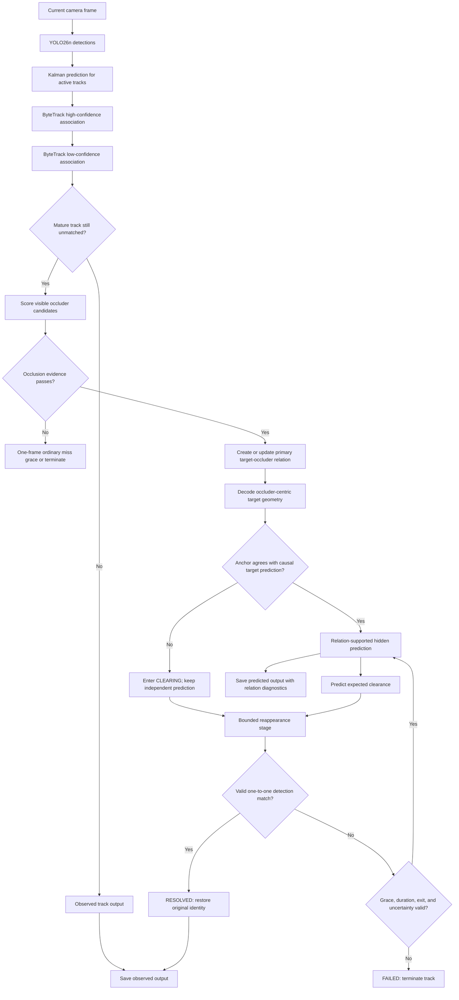
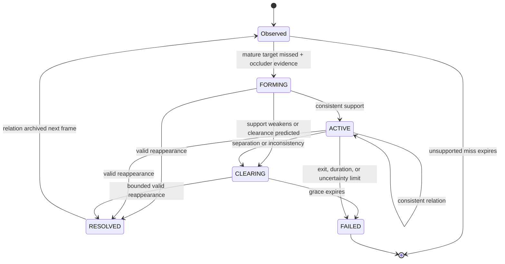

# OATM: Report and Presentation Guide

## Document purpose

This document is the single writing reference for the student report,
presentation, and poster. The method should be presented as **Occlusion-Adaptive
Temporal Memory (OATM)**. The original OATM concept was updated with explicit
target--occluder reasoning, bounded relational geometry, clearance prediction,
and protected identity reconnection.

The strongest evidence-supported statement is:

> OATM uses causal camera-only target--occluder memory to preserve objects
> through temporary visual absence while limiting drift, identity hijacking,
> and ghost persistence. It improves the recovery--ghost tradeoff over fixed
> short-buffer ByteTrack in deterministic mechanism tests. In a small
> nuScenes-mini natural-event pilot, it improved persistence and same-ID
> recovery over the earlier camera-only experiments, while ByteTrack with a
> longer generic buffer retained higher hidden coverage.

Do not shorten this to “OATM beats ByteTrack” without the synthetic or pilot
qualification. The natural pilot contains only two linkable events.

---

## 1. Report-ready abstract

Camera object detectors can lose vehicles and pedestrians when they become
temporarily occluded, causing fragmented identities and unstable scene state.
We present Occlusion-Adaptive Temporal Memory (OATM), a causal camera-only
tracking method that extends confidence-aware association with explicit
target--occluder relations. When a mature target disappears, OATM estimates
whether a visible object plausibly explains the disappearance, stores the
target in an occluder-centric coordinate system, predicts the expected
clearance time, and restricts identity reconnection to a bounded relation-aware
association stage. Consistency checks reject occluder jumps and distant
reappearances, while clearance and uncertainty rules terminate unsupported
tracks. On eight deterministic stress scenarios, OATM obtained 100% mean hidden
coverage and same-ID recovery, 4.403 px center error, and 2.000 negative ghost
frames, compared with 94.3% coverage, 60% same-ID recovery, 4.813 px error, and
5.000 ghost frames for ByteTrack with a five-frame buffer. In a nuScenes-mini
pilot, only two of six reviewed events were linkable; OATM reached 62.0% hidden
coverage, one same-ID recovery, and 16.019 px error. These results validate the
mechanism and motivate larger scene-disjoint controlled and natural evaluation,
but do not establish general benchmark superiority.

## 2. Problem and motivation

### 2.1 The failure being addressed

A detector observes only the current image. During occlusion it may produce:

- a weak detection;
- no detection;
- a box on the occluder instead of the target; or
- a later detection with a new identity.

The earlier experiments established a progression:

1. A detector alone usually loses a fully hidden target.
2. Freezing the last box preserves existence but produces severe location
   error when the scene moves.
3. SORT predicts motion, but constant velocity degrades over longer gaps.
4. ByteTrack recovers weak detections, but when a detection is completely
   absent it can only wait on generic motion prediction until its buffer ends.
5. OATM asks a different question: **is the disappearance actually explained
   by a visible occluder, and when should that explanation stop?**

### 2.2 Research question

Can an explicit, causal target--occluder relation improve hidden-object
persistence and identity continuity without paying the ghost duration of a
long generic track buffer?

### 2.3 Hypothesis

A mature missing target should persist only while current camera evidence and
track history support an occlusion relation. Predicting target and occluder
geometry jointly should provide a better recovery--ghost tradeoff than applying
the same lifetime to every missing track.

## 3. Main contributions

1. **Occlusion-conditioned persistence.** Missing tracks do not automatically
   receive long memory. Persistence requires a plausible visible occluder.
2. **Explicit relational state.** Each supported target records a primary
   occluder, coverage, probability, expected clearance, and lifecycle phase.
3. **Occluder-centric geometry memory.** The hidden target is stored as a
   normalized center offset and scale relative to its primary occluder.
4. **Dual-prediction consistency.** Relational geometry is checked against the
   target’s independent causal Kalman prediction. An implausible occluder jump
   starts clearing instead of dragging the target.
5. **Expected-clearance termination.** OATM predicts when target--occluder
   overlap should end and terminates if the target fails to reappear after a
   bounded grace window.
6. **Protected reappearance association.** A relationally hidden target is
   removed from ordinary ByteTrack matching. Reconnection uses a stricter
   one-to-one stage with a hard spatial cap.
7. **Auditable outputs.** Current visual detections and temporal predictions
   have separate states and evidence sources in saved results.

## 4. Scientific operating boundary

### Online input

The deployed tracker receives only:

- the current and earlier camera frames;
- camera-derived object detections; and
- causal tracker history.

### Privileged evaluation evidence

nuScenes 3D boxes, visibility labels, calibration, LiDAR/radar information,
instance tokens, and recorded ego pose are used only to prepare or evaluate
events. They are never online inputs to OATM.

### Causality

At frame `t`, OATM may use frame `t` and earlier frames only. It never reads a
future detection or future ground-truth box.

## 5. Methodology

### 5.1 Detector and ByteTrack foundation

The detector emits class, confidence, and 2D image box. OATM retains
ByteTrack’s two association rounds:

1. match high-confidence detections to predicted tracks;
2. match remaining tracks to low-confidence detections;
3. allow only unmatched high-confidence detections to create new tracks.

This preserves ByteTrack’s useful treatment of weak-but-present visual
evidence. OATM activates only after these ordinary association rounds cannot
observe a mature target.

### 5.2 Occlusion candidate features

For an unmatched target and each visible candidate occluder, OATM computes:

- target-relative coverage, `intersection(target, occluder) / area(target)`;
- occluder-to-target scale ratio;
- a 2D depth-order cue from the lower image boundary;
- target--occluder trajectory agreement;
- target track maturity; and
- optional camera-motion quality.

The weighted score is deterministic and interpretable. It is an engineering
score, not a calibrated probability distribution.

### 5.3 Relational lifecycle

Each hidden target owns at most one primary relation:

| Phase | Meaning | Permitted transition |
|---|---|---|
| `FORMING` | A visible occluder first explains disappearance | `ACTIVE`, `CLEARING`, `RESOLVED`, `FAILED` |
| `ACTIVE` | Relation remains geometrically consistent | `ACTIVE`, `CLEARING`, `RESOLVED`, `FAILED` |
| `CLEARING` | Separation is predicted or support became inconsistent | `RESOLVED`, `FAILED` |
| `RESOLVED` | A valid visual detection reconnects the identity | archived before next frame |
| `FAILED` | Persistence evidence ended without valid recovery | track terminated |

The primary occluder cannot switch during one hidden episode. This prevents a
different nearby object from silently taking ownership of the target.

### 5.4 Occluder-centric geometry

At relation formation, target box `T` is encoded relative to occluder box `O`:

```text
dx = (target_cx - occluder_cx) / occluder_width
dy = (target_cy - occluder_cy) / occluder_height
rw = target_width / occluder_width
rh = target_height / occluder_height
```

The current occluder decodes this memory on later frames. The decoded target is
accepted only when it agrees with the independently predicted target within:

- center residual: `max(20 px, 0.75 × predicted-box diagonal)`; and
- per-axis scale ratio: between `1/1.25` and `1.25`.

If the relation violates either bound, OATM keeps the causal target prediction
and enters `CLEARING`; it does not follow the inconsistent anchor.

### 5.5 Expected clearance

Target and occluder boxes are propagated over a bounded 12-frame horizon. The
first future step where target-relative coverage falls below `0.05` is the
expected clearance. After clearing, the target receives a four-frame
reappearance grace window.

### 5.6 Reappearance association

Relationally hidden tracks are excluded from ordinary ByteTrack matching. A
third stage scores remaining detections using:

- class agreement;
- distance to the causal predicted target box;
- box-scale agreement; and
- expected-clearance timing.

The score threshold is `0.55`, matching is one-to-one, and the uncertainty-
expanded search radius is hard-capped at 150 px. An active visible occluder
blocks reconnection unless the relation is clearing. These rules address
same-class identity hijacking and distant weak-detection reconnection.

### 5.7 Termination

A hidden target is removed when any of these conditions holds:

- it is predicted to exit the image;
- the track is immature;
- no occlusion relation exists beyond the ordinary one-frame grace;
- expected clearance passes without reappearance;
- hidden duration exceeds 12 frames; or
- localization uncertainty exceeds the configured ceiling.

### 5.8 Camera-motion ablation

Background ORB features and RANSAC translation estimation were implemented as a
camera-only ablation. It helped a controlled pan scenario but produced severe
long-sequence drift in natural pilots because image translation was added to a
Kalman state that already modeled image-space velocity. Camera compensation is
therefore disabled in the promoted method. It should return only after motion
and target state are fused in one stabilized coordinate system.

## 6. Pipeline drawing



### Compact slide version

```text
Camera → Detector → ByteTrack association
                         │
                         └─ unmatched mature target
                                      ↓
                          Target–occluder scoring
                                      ↓
                     Occluder-centric temporal memory
                                      ↓
                 Anchor consistency + expected clearance
                                      ↓
              Reconnect original ID or terminate safely
```

## 7. State-machine drawing



## 8. Implementation parameters

| Component | Final value |
|---|---:|
| Detection floor | 0.05 |
| High-score threshold | 0.50 |
| New-track threshold | 0.60 |
| First association IoU | 0.30 |
| Second association IoU | 0.50 |
| Relation score threshold | 0.48 |
| Target coverage threshold | 0.12 |
| Clearance coverage threshold | 0.05 |
| Maximum hidden duration | 12 frames |
| Reappearance grace | 4 frames |
| Reappearance score threshold | 0.55 |
| Minimum anchor residual allowance | 20 px |
| Anchor residual ratio | 0.75 × target diagonal |
| Maximum anchor scale ratio | 1.25 |
| Camera compensation | disabled in promoted method |

## 9. Output semantics

Every row makes evidence explicit:

| Output | Meaning |
|---|---|
| `OBSERVED_STRONG` | Current high-confidence visual detection |
| `OBSERVED_WEAK` | Current low-confidence visual detection |
| `PREDICTED_HIDDEN` | Temporal prediction; not a current detection |
| `evidence_source` | Strong detection, weak detection, or motion prediction |
| `occluder_track_id` | Primary relation owner, if present |
| `occlusion_probability` | Deterministic relation score |
| `expected_clearance_frames` | Predicted separation horizon |
| `relation_phase` | `FORMING`, `ACTIVE`, `CLEARING`, `RESOLVED`, or `FAILED` |
| `localization_uncertainty` | Kalman covariance trace |

In writing and figures, a predicted hidden box must never be called a current
detection.

## 10. Experimental setup

### 10.1 Dataset and detector

- Dataset: nuScenes mini, read only.
- Camera channel: `CAM_FRONT`.
- Scenes: 10.
- Camera frames: 2,342.
- Keyframes: 404.
- Accepted projected annotations: 5,384.
- Detector: pretrained `yolo26n.pt`, prediction only.
- Detector confidence floor: 0.05.
- Device: CPU.
- Fresh detections: 49,436.
- Detector runtime: 860.4 s for all 2,342 frames.

Projected annotations are privileged evaluation evidence only.

### 10.2 Event families

Results must remain separated by event family:

1. **Synthetic mechanism scenarios:** deterministic short/long occlusion,
   moving and multiple occluders, camera pan, ordinary miss, field-of-view
   exit, and failed reappearance.
2. **Natural events:** reviewed nuScenes events scored against projected
   annotations.
3. **Controlled visual events:** required future evidence; not completed for
   the final configuration.
4. **Verified negative events:** required future ghost/exit evidence; current
   negative evidence is synthetic.

### 10.3 Metrics

- **Hidden coverage:** fraction of hidden frames where the original track ID
  remains alive.
- **Fully bridged rate:** fraction of events alive throughout the complete
  hidden interval.
- **Same-ID recovery:** whether the reappearing target uses its original ID.
- **New-ID recovery:** target returns visually but with a different ID.
- **Center error:** Euclidean distance between predicted and evaluation box
  centers.
- **Ghost duration:** number of output frames after a verified miss/exit where
  the target should not persist.
- **Wrong association:** target identity attaches to another object.

Coverage and center error must be interpreted together: a method that dies
early may report low error only on easy early frames.

## 11. Comparison with earlier experiments

These experiments use different samples and protocols. They show the
development of the problem; their numbers must not be combined into one
ranking.

| Experiment | Main mechanism | Key local result | Limitation that motivates OATM |
|---|---|---|---|
| YOLO-only | Independent detection per frame | Full-occlusion detection fell to 1/8 (12%); mean confidence fell from 0.77 visible to 0.03 hidden | No temporal persistence or identity |
| Last-seen memory | Freeze the last detected box | 331 px mean center error and 0.085 mean IoU on 5 valid samples | Preserves existence but ignores motion and creates ghosts |
| SORT | Kalman constant velocity + IoU/Hungarian association | At 5-frame artificial gaps: 6.50 px error vs 34.21 px static; at 10 frames: 31.33 px vs 64.49 px | Prediction drifts with long/nonlinear motion; experiment used withheld detections as pseudo-ground truth |
| ByteTrack | High-score then low-score association | Earlier study: 8/12 natural recoveries and 6/12 preserved IDs vs SORT 7/12 and 4/12; controlled coverage 99.2% | Recovers weak evidence, but cannot reason about a target with no current detection |
| OATM | ByteTrack + target--occluder memory + adaptive termination | Final identical-input results are reported below | Current natural pilot is very small; larger negative and scene-disjoint evidence remains required |

### Interpretation of the progression

- YOLO establishes the occlusion failure.
- Static memory shows that persistence alone is not enough.
- SORT shows why motion prediction matters.
- ByteTrack shows why weak detections should not be discarded.
- OATM adds an explanation for complete temporary absence and a reasoned rule
  for when persistence must end.

## 12. Direct final comparison: identical synthetic inputs

Run ID: `eac923a94d04`; eight scenarios; seed 42.

| Method | Hidden coverage | Fully bridged | Same-ID recovery | Center error | Negative ghost frames | Wrong associations |
|---|---:|---:|---:|---:|---:|---:|
| ByteTrack, buffer 5 | 94.3% | 80% | 60% | 4.813 px | 5.000 | 0 |
| ByteTrack, buffer 12 | 100% | 100% | 100% | 4.814 px | 6.333 | 0 |
| **OATM** | **100%** | **100%** | **100%** | **4.403 px** | **2.000** | **0** |

### Main synthetic finding

OATM matched the recovery of the long-buffer ByteTrack arm while reducing
negative ghost duration from 6.333 to 2.000 frames. Against ByteTrack-5, OATM
improved coverage, full bridging, and same-ID recovery while also reducing
ghost duration. This is the clearest evidence for adaptive relational
persistence over generic waiting.

Synthetic scenarios validate mechanics; they are not a driving benchmark.

## 13. Direct final comparison: natural pilot

Run ID: `806945a64e0d`; identical frozen detector observations. Six events were
reviewed, but only two could be linked at the pre-occlusion reference frame.

| Method | Linkable events | Hidden coverage | Fully bridged | Same-ID recoveries | New-ID recoveries | Center error |
|---|---:|---:|---:|---:|---:|---:|
| ByteTrack, buffer 5 | 2 | 24.5% | 0% | 0 | 2 | 10.272 px |
| ByteTrack, buffer 12 | 2 | **76.0%** | **50%** | **1** | 1 | 20.672 px |
| **OATM** | 2 | 62.0% | **50%** | **1** | 1 | **16.019 px** |

### Main natural-pilot finding

OATM substantially improved over ByteTrack-5 in coverage and identity recovery.
It reached the same fully bridged and same-ID counts as ByteTrack-12 with lower
center error, but ByteTrack-12 retained higher coverage. This is a mixed result,
not a general win.

The lower ByteTrack-5 error should not be read alone: ByteTrack-5 remained alive
for far fewer hidden frames, so it was evaluated mainly on easier early frames.

## 14. Ablation evidence

### Clearance termination

On synthetic negatives, disabling clearance termination increased mean ghost
duration from 2.000 to 2.667 frames without improving positive-event coverage.
This supports clearance as a safety contribution rather than decorative
complexity.

### Camera motion

The camera-motion branch reduced error in a controlled pan but failed on long
natural sequences. It remains implemented for analysis but is disabled in the
promoted OATM configuration.

### Localization safeguards

Before anchor consistency and bounded reappearance were added, a natural pilot
produced 387.890 px center error. The final safeguards reduced it to 16.019 px
while retaining 62.0% hidden coverage. This is important engineering evidence
for rejecting inconsistent occluder state instead of blindly following it.

## 15. What may be claimed

### Supported claims

- OATM is causal and camera-only online.
- OATM distinguishes current detections from temporal predictions.
- OATM conditions extended persistence on visible occlusion evidence.
- OATM matches long-buffer ByteTrack recovery with shorter synthetic ghost
  duration in the deterministic mechanism study.
- OATM improves over ByteTrack-5 on the two linkable natural pilot events in
  coverage and same-ID recovery.
- OATM’s localization safeguards removed catastrophic relational drift.

### Unsupported claims

- “OATM universally outperforms ByteTrack.”
- “OATM reproduces MOT17, MOT20, nuScenes tracking, or published ByteTrack
  benchmark results.”
- “OATM uses LiDAR online.”
- “The engineering occlusion score is a calibrated probability.”
- “Two natural events establish statistical significance.”
- “Synthetic negative results establish real-world ghost safety.”

## 16. Limitations and future work

1. Only two of six reviewed natural events were linkable.
2. Natural-event selection and projected references are sparse at nuScenes
   keyframes.
3. Verified real exits, ordinary misses, and failed-reappearance negatives are
   still required.
4. Controlled visual occlusion should be rerun for the final configuration.
5. Thresholds require calibration on scene-disjoint development scenes.
6. Visible-frame precision loss has not yet been fully quantified for the final
   method.
7. Camera-motion fusion needs a single stabilized coordinate state before it
   can be reconsidered.
8. Larger evaluation should report confidence intervals and per-class results.

## 17. Suggested student report structure

1. **Introduction:** detection failure under occlusion and why persistence is
   safety-relevant.
2. **Background:** YOLO, static memory, SORT, and ByteTrack lessons.
3. **Research gap:** weak-evidence association does not explain complete visual
   absence.
4. **Proposed OATM method:** relation score, lifecycle, relational geometry,
   clearance, reappearance, and termination.
5. **Implementation:** camera-only boundary, parameters, outputs, and tests.
6. **Experimental design:** synthetic and natural results kept separate.
7. **Results:** identical-input ByteTrack comparisons.
8. **Discussion:** recovery--ghost tradeoff, localization repair, and mixed
   natural result.
9. **Limitations and ethics:** no invented evidence or inflated benchmark
   claim.
10. **Conclusion and future work.**

## 18. Presentation outline

### Slide 1 — Title

**Occlusion-Adaptive Temporal Memory: Camera-Only Object Persistence Through
Temporary Occlusion**

Say: “Our goal is not to hallucinate missing objects. It is to preserve a
track only when current camera evidence explains why the object disappeared.”

### Slide 2 — The problem

- Show visible → partial → fully hidden → reappeared sequence.
- Use the YOLO result: only 1/8 targets detected at full occlusion.

### Slide 3 — Lessons from previous experiments

- Static memory: 331 px error.
- SORT: motion helps but drifts with long gaps.
- ByteTrack: weak detections help, complete absence remains unresolved.

### Slide 4 — Research question and contribution

- Introduce target--occluder relation.
- State adaptive persistence versus generic buffer.

### Slide 5 — Pipeline

- Use the compact or full Mermaid pipeline.
- Color observed detections differently from predicted hidden boxes.

### Slide 6 — Relation state machine

- Explain `FORMING`, `ACTIVE`, `CLEARING`, `RESOLVED`, `FAILED`.

### Slide 7 — Safety against drift and ghosts

- Immutable primary occluder.
- Anchor consistency.
- Expected clearance.
- Hard-capped reappearance.

### Slide 8 — Synthetic comparison

- Use the recovery–ghost frontier chart.
- Highlight OATM: 100% coverage, 2.0 ghost frames.

### Slide 9 — Natural pilot

- OATM: 62% coverage, 16.019 px error, one same-ID recovery.
- ByteTrack-12: 76% coverage, 20.672 px error, one same-ID recovery.
- Clearly display “2 linkable events — pilot evidence.”

### Slide 10 — Conclusion

- Mechanism works under controlled stress.
- Natural result is promising but mixed.
- Next step: controlled visual and verified real negatives on scene-disjoint
  splits.

## 19. Poster layout

### Left column

- Problem and motivation.
- Earlier experiment progression.
- Research question and contributions.

### Center column

- Large OATM pipeline.
- Relation state machine.
- Occluder-centric geometry equation.

### Right column

- Synthetic recovery–ghost table/chart.
- Natural pilot table.
- Limitations and future work.

Use one consistent legend:

- green solid box: current visual detection;
- blue dashed box: OATM temporal prediction;
- orange box: primary occluder;
- red cross: terminated or rejected relation.

## 20. Ready-to-use methodology paragraph

OATM begins with ByteTrack’s high- then low-confidence association rounds. If a
mature target remains unmatched, the tracker evaluates visible objects as
candidate occluders using target-relative coverage, scale, image-space depth
order, motion agreement, and track maturity. A supported target stores a single
primary target--occluder relation and encodes its box in occluder-centric
coordinates. On later frames, the relational box must agree with the target’s
independent causal motion prediction; otherwise the relation enters a clearing
state rather than moving the target. OATM predicts when target--occluder overlap
should end and uses a bounded one-to-one reappearance stage to restore the
original identity. Tracks terminate on unsupported disappearance, predicted
exit, failed expected reappearance, excessive duration, or uncertainty.

## 21. Ready-to-use results paragraph

In eight deterministic stress scenarios, OATM reached 100% mean hidden
coverage, 100% fully bridged rate, and 100% same-ID recovery with 4.403 px mean
center error, 2.000 negative ghost frames, and no measured wrong associations.
ByteTrack with a five-frame buffer reached 94.3% coverage, 80% fully bridged,
60% same-ID recovery, 4.813 px error, and 5.000 ghost frames. A twelve-frame
ByteTrack buffer matched OATM’s recovery but produced 6.333 ghost frames. In the
natural nuScenes-mini pilot, OATM reached 62.0% hidden coverage and 16.019 px
error, while ByteTrack-12 reached 76.0% and 20.672 px. Because only two events
were linkable, the natural result is reported as a pilot rather than a
superiority claim.

## 22. Ready-to-use conclusion

OATM demonstrates that temporary object persistence can be conditioned on an
explicit visual explanation rather than a fixed waiting time. The combination
of target--occluder memory, clearance prediction, and protected reappearance
matched long-buffer recovery with substantially shorter synthetic ghost
duration. Bounded anchor and reappearance checks also reduced natural
localization drift from 387.890 px in an early ablation to 16.019 px in the
final method. The remaining challenge is evidence scale: larger controlled,
negative, and scene-disjoint natural studies are needed before claiming general
superiority over ByteTrack.

## 23. Suggested figure captions

### Architecture figure

**Figure 1.** OATM extends ByteTrack with an occlusion-conditioned branch.
Observed detections follow ordinary high/low-confidence association; only a
mature unmatched target enters target--occluder reasoning and temporal memory.

### Recovery–ghost frontier

**Figure 2.** Recovery versus negative ghost persistence on deterministic
stress scenarios. OATM matches the recovery of ByteTrack-12 while using less
than one-third of its mean negative ghost duration.

### Localization chart

**Figure 3.** Mean hidden-box center error in the synthetic mechanism study.
All compared methods use identical detections and target trajectories.

### Natural pilot table

**Table 1.** Natural-event pilot on frozen nuScenes-mini detector observations.
Only two reviewed events were linkable; results are descriptive, not
statistically powered.

## 24. Likely examiner questions

### Is OATM still camera-only if nuScenes LiDAR boxes are used?

Yes. LiDAR-supported annotations and calibration are offline evaluation
evidence only. The online tracker receives camera frames, camera detections,
and causal history.

### Why not simply increase ByteTrack’s buffer?

A longer buffer improves recall but applies persistence to every missing track.
In the synthetic negatives, ByteTrack-12 produced 6.333 ghost frames versus
2.000 for OATM. OATM uses occlusion and clearance evidence to decide who should
persist and when persistence should end.

### Does OATM hallucinate a detection?

No. It emits an explicitly labeled temporal prediction. Saved outputs separate
raw visual detections from predicted hidden boxes.

### Why is ByteTrack-5 center error lower in the natural pilot?

It survives only 24.5% of hidden frames, so its error is measured mainly on
early/easier frames. Coverage and localization error must be interpreted
together.

### Is the occlusion probability learned?

No. It is a deterministic weighted engineering score. Calibration or learned
relation scoring is future work.

### Is OATM proven superior to ByteTrack?

It shows a superior synthetic recovery--ghost tradeoff and encouraging pilot
evidence, but ByteTrack-12 retains higher natural coverage and the pilot is too
small for a general superiority claim.

## 25. Reproduction

From the final OATM workspace:

```bash
uv sync --locked
uv run pytest -q
uv run ruff check .
uv run python scripts/run_relational_study.py
uv run python scripts/prepare_nuscenes.py
uv run python scripts/run_detector.py
uv run python scripts/run_natural_study.py \
  --methods bytetrack_b5 bytetrack_b12 relational_complete \
  --output-stem natural_promoted
```

## 26. References

1. A. Bewley, Z. Ge, L. Ott, F. Ramos, and B. Upcroft, “Simple Online and
   Realtime Tracking,” *IEEE International Conference on Image Processing*,
   2016. DOI: 10.1109/ICIP.2016.7533003.
2. Y. Zhang et al., “ByteTrack: Multi-Object Tracking by Associating Every
   Detection Box,” *European Conference on Computer Vision*, 2022. DOI:
   10.1007/978-3-031-20047-2_1.

## 27. Final checklist for the student

- [ ] Call the final method **OATM**, not by a workspace or version name.
- [ ] State that the original OATM design was updated with relational memory.
- [ ] Separate current detections from temporal predictions.
- [ ] State the camera-only online boundary.
- [ ] Keep synthetic and natural results in separate tables.
- [ ] Put sample sizes beside every result.
- [ ] Compare methods directly only when they share identical inputs.
- [ ] Report coverage, identity, localization, and ghosts together.
- [ ] Do not claim benchmark reproduction or universal ByteTrack superiority.
- [ ] End with controlled visual, verified negatives, and scene-disjoint
  evaluation as future work.
