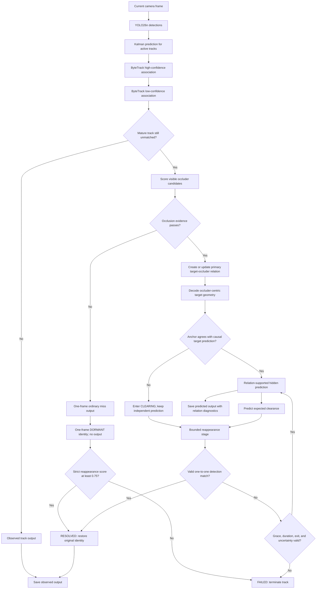

# OATM: Report and Presentation Guide

## Document purpose

This document is the single writing reference for the student report,
presentation, and poster. The method should be presented as **Occlusion-Adaptive
Temporal Memory (OATM)**. The original OATM concept was updated with explicit
target--occluder reasoning, bounded relational geometry, clearance prediction,
and protected identity reconnection.

The strongest evidence-supported statement is:

> In the final five-scene validation experiment, OATM achieved the strongest
> F1, MOTA, IDF1, localization, identity-switch count, fragmentation count,
> predicted-hidden precision, and unsupported-track control among the tested
> methods. These results show that causal camera-only target--occluder memory
> can provide a stronger balanced accuracy--identity--persistence tradeoff than
> fixed ByteTrack buffer settings.

Scope this statement to run `lidar-fixes-20260805`, nuScenes mini, the matched
local detections, and the reported metrics. Keep all weaknesses in the dedicated
limitations section.

---

## 1. Report-ready abstract

Camera object detectors can lose vehicles and pedestrians when they become
temporarily occluded, causing fragmented identities and unstable scene state.
We present Occlusion-Adaptive Temporal Memory (OATM), a causal camera-only
tracking method that extends confidence-aware association with explicit
target--occluder relations. When a mature target disappears, OATM estimates
whether a visible object plausibly explains the disappearance, stores the
target in an occluder-centric coordinate system, predicts the expected
clearance time, and restricts identity reconnection to a bounded relation-aware
association stage. Consistency checks reject occluder jumps and distant
reappearances, while clearance and uncertainty rules terminate unsupported
tracks. On five validation scenes containing 1,873 projected car/pedestrian
annotations, OATM reached 84.1% precision, 40.4% F1, 18.4% MOTA, and 30.3% IDF1.
It achieved the strongest F1, MOTA, IDF1, localization,
identity-switch count, predicted-hidden precision, and unsupported-track
control among the evaluated methods. The result supports a stronger balanced
accuracy and identity tradeoff while preserving the camera-only inference
boundary.

## 2. Problem and motivation

### 2.1 The failure being addressed

A detector observes only the current image. During occlusion it may produce:

- a weak detection;
- no detection;
- a box on the occluder instead of the target; or
- a later detection with a new identity.

The relevant design lessons form a progression:

1. A detector alone usually loses a fully hidden target.
2. Freezing the last box preserves existence but produces severe location
   error when the scene moves.
3. SORT predicts motion, but constant velocity degrades over longer gaps.
4. ByteTrack recovers weak detections, but when a detection is completely
   absent it can only wait on generic motion prediction until its buffer ends.
5. OATM asks a different question: **is the disappearance actually explained
   by a visible occluder, and when should that explanation stop?**

### 2.2 Research question

Can an explicit, causal target--occluder relation improve hidden-object
persistence and identity continuity without paying the ghost duration of a
long generic track buffer?

### 2.3 Hypothesis

A mature missing target should persist only while current camera evidence and
track history support an occlusion relation. Predicting target and occluder
geometry jointly should provide a better recovery--ghost tradeoff than applying
the same lifetime to every missing track.

## 3. Main contributions

1. **Occlusion-conditioned persistence.** Missing tracks do not automatically
   receive long memory. Persistence requires a plausible visible occluder.
2. **Explicit relational state.** Each supported target records a primary
   occluder, coverage, probability, expected clearance, and lifecycle phase.
3. **Occluder-centric geometry memory.** The hidden target is stored as a
   normalized center offset and scale relative to its primary occluder.
4. **Dual-prediction consistency.** Relational geometry is checked against the
   target’s independent causal Kalman prediction. An implausible occluder jump
   starts clearing instead of dragging the target.
5. **Expected-clearance termination.** OATM predicts when target--occluder
   overlap should end and terminates if the target fails to reappear after a
   bounded grace window.
6. **Protected reappearance association.** A relationally hidden target is
   removed from ordinary ByteTrack matching. Reconnection uses a stricter
   one-to-one stage with a hard spatial cap.
7. **Silent identity reactivation.** A mature unsupported identity may wait
   internally for one frame without emitting a box, then reconnect only through
   a higher-threshold association.
8. **Auditable outputs.** Current visual detections and temporal predictions
   have separate states and evidence sources in saved results.

## 4. Scientific operating boundary

### Online input

The deployed tracker receives only:

- the current and earlier camera frames;
- camera-derived object detections; and
- causal tracker history.

### Privileged evaluation evidence

nuScenes 3D boxes, visibility labels, calibration, LiDAR/radar information,
instance tokens, and recorded ego pose are used only to prepare or evaluate
events. They are never online inputs to OATM.

### How occlusion is identified in the LiDAR-supported evaluation

The evaluation does **not** determine occlusion from LiDAR alone. The more
accurate description is a nuScenes annotation evaluation with LiDAR-supported
metadata. For each official annotated keyframe, the offline evaluator uses:

1. The official nuScenes 3D object annotation and persistent instance token.
2. Camera calibration and ego pose to project that 3D box into `CAM_FRONT`.
3. The annotation's coarse `visibility_token` and LiDAR/radar point counts.

The nuScenes visibility levels describe the visible fraction of the whole
annotated object:

| Visibility token | Annotated visible fraction | Evaluation interpretation |
|---|---:|---|
| `1` | 0--40% | Most-occluded visibility bin |
| `2` | 40--60% | Heavily obscured |
| `3` | 60--80% | Partly obscured |
| `4` | 80--100% | Most-visible visibility bin |

After camera-only tracking has finished and its outputs have been saved, the
evaluator performs class-aware one-to-one matching between tracker boxes and
the projected `CAM_FRONT` annotations. The primary match gate is IoU 0.30.
Recall in visibility bin `1` is therefore reported as severe-visibility or
most-occluded-bin recall.

LiDAR point count is **not** used to decide whether an object is occluded. It
is reported only as a sensitivity stratum indicating annotation sensor support.
An object may contain zero LiDAR points because of distance, sparse sampling,
surface properties, or occlusion, so zero points must not be translated into
"occluded." Zero-point annotations remain in the headline denominator.

This protocol provides coarse offline evidence, not an exact per-camera
pixel-occlusion mask. It does not by itself identify the physical occluder or
the precise start, end, and duration of an occlusion. Exact event-level claims
require manual `CAM_FRONT` review or a dedicated per-camera occlusion-labeling
procedure. During inference, OATM estimates target--occluder relations only
from causal camera detections, box overlap, scale, motion, and track history;
LiDAR, visibility labels, calibration, annotations, and ego pose are absent.

### Causality

At frame `t`, OATM may use frame `t` and earlier frames only. It never reads a
future detection or future ground-truth box.

## 5. Methodology

### 5.1 Detector and ByteTrack foundation

The detector emits class, confidence, and 2D image box. OATM retains
ByteTrack’s two association rounds:

1. match high-confidence detections to predicted tracks;
2. match remaining tracks to low-confidence detections;
3. allow only unmatched high-confidence detections to create new tracks.

This preserves ByteTrack’s useful treatment of weak-but-present visual
evidence. OATM activates only after these ordinary association rounds cannot
observe a mature target.

### 5.2 Occlusion candidate features

For an unmatched target and each visible candidate occluder, OATM computes:

- target-relative coverage, `intersection(target, occluder) / area(target)`;
- occluder-to-target scale ratio;
- a 2D depth-order cue from the lower image boundary;
- target--occluder trajectory agreement;
- target track maturity; and
- optional camera-motion quality.

The weighted score is deterministic and interpretable. It is an engineering
score, not a calibrated probability distribution.

### 5.3 Relational lifecycle

Each hidden target owns at most one primary relation:

| Phase | Meaning | Permitted transition |
|---|---|---|
| `FORMING` | A visible occluder first explains disappearance | `ACTIVE`, `CLEARING`, `RESOLVED`, `FAILED` |
| `ACTIVE` | Relation remains geometrically consistent | `ACTIVE`, `CLEARING`, `RESOLVED`, `FAILED` |
| `CLEARING` | Separation is predicted or support became inconsistent | `RESOLVED`, `FAILED` |
| `RESOLVED` | A valid visual detection reconnects the identity | archived before next frame |
| `FAILED` | Persistence evidence ended without valid recovery | track terminated |

The primary occluder cannot switch during one hidden episode. This prevents a
different nearby object from silently taking ownership of the target.

### 5.4 Occluder-centric geometry

At relation formation, target box `T` is encoded relative to occluder box `O`:

```text
dx = (target_cx - occluder_cx) / occluder_width
dy = (target_cy - occluder_cy) / occluder_height
rw = target_width / occluder_width
rh = target_height / occluder_height
```

The current occluder decodes this memory on later frames. The decoded target is
accepted only when it agrees with the independently predicted target within:

- center residual: `max(20 px, 0.75 × predicted-box diagonal)`; and
- per-axis scale ratio: between `1/1.25` and `1.25`.

If the relation violates either bound, OATM keeps the causal target prediction
and enters `CLEARING`; it does not follow the inconsistent anchor.

### 5.5 Expected clearance

Target and occluder boxes are propagated over a bounded 12-frame horizon. The
first future step where target-relative coverage falls below `0.05` is the
expected clearance. After clearing, the target receives a four-frame
reappearance grace window.

### 5.6 Reappearance association

Relationally hidden tracks are excluded from ordinary ByteTrack matching. A
third stage scores remaining detections using:

- class agreement;
- distance to the causal predicted target box;
- box-scale agreement; and
- expected-clearance timing.

The score threshold is `0.55`, matching is one-to-one, and the uncertainty-
expanded search radius is hard-capped at 150 px. An active visible occluder
blocks reconnection unless the relation is clearing. These rules address
same-class identity hijacking and distant weak-detection reconnection.

A mature unsupported identity receives one additional silent `DORMANT` frame
after ordinary miss grace. It emits no box, cannot enter ordinary association,
and must pass a separate 0.75 reappearance threshold to recover its original
identity. Failure terminates the dormant identity.

### 5.7 Termination

A hidden target is removed when any of these conditions holds:

- outward motion reaches an image edge while no more than 60% of the
  predicted box remains visible;
- the track is immature;
- no occlusion relation exists beyond the ordinary one-frame output grace and
  one silent dormant identity frame;
- expected clearance passes without reappearance;
- hidden duration exceeds 12 frames; or
- localization uncertainty exceeds the configured ceiling.

### 5.8 Camera-motion configuration

Camera-motion compensation is disabled in the final promoted configuration and
was not used for the reported final experiment. The final method relies on its
causal image-space motion state, relational geometry, and lifecycle safeguards.

## 6. Pipeline drawing



### Compact slide version

```text
Camera → Detector → ByteTrack association
                         │
                         └─ unmatched mature target
                                      ↓
                          Target–occluder scoring
                                      ↓
                     Occluder-centric temporal memory
                                      ↓
                 Anchor consistency + expected clearance
                                      ↓
              Reconnect original ID or terminate safely
```

## 7. State-machine drawing

```mermaid
stateDiagram-v2
    [*] --> Observed
    Observed --> FORMING: mature target missed + occluder evidence
    Observed --> OrdinaryMiss: unsupported first miss
    OrdinaryMiss --> DORMANT: output grace expires; emit nothing
    DORMANT --> Observed: strict valid reappearance
    DORMANT --> [*]: silent frame expires
    FORMING --> ACTIVE: consistent support
    FORMING --> CLEARING: support weakens or clearance predicted
    ACTIVE --> ACTIVE: consistent relation
    ACTIVE --> CLEARING: separation or inconsistency
    FORMING --> RESOLVED: valid reappearance
    ACTIVE --> RESOLVED: valid reappearance
    CLEARING --> RESOLVED: bounded valid reappearance
    CLEARING --> FAILED: grace expires
    ACTIVE --> FAILED: exit, duration, or uncertainty limit
    RESOLVED --> Observed: relation archived next frame
    FAILED --> [*]
```



## 8. Implementation parameters

| Component | Final value |
|---|---:|
| Detection floor | 0.05 |
| High-score threshold | 0.50 |
| New-track threshold | 0.60 |
| First association IoU | 0.30 |
| Second association IoU | 0.50 |
| Relation score threshold | 0.48 |
| Target coverage threshold | 0.12 |
| Clearance coverage threshold | 0.05 |
| Maximum hidden duration | 12 frames |
| Reappearance grace | 4 frames |
| Relation reappearance score threshold | 0.55 |
| Ordinary unsupported output grace | 1 frame |
| Silent dormant identity window | 1 frame |
| Dormant reappearance score threshold | 0.75 |
| Exit visible-box fraction | 0.60 |
| Minimum anchor residual allowance | 20 px |
| Anchor residual ratio | 0.75 × target diagonal |
| Maximum anchor scale ratio | 1.25 |
| Camera compensation | disabled in promoted method |

## 9. Output semantics

Every row makes evidence explicit:

| Output | Meaning |
|---|---|
| `OBSERVED_STRONG` | Current high-confidence visual detection |
| `OBSERVED_WEAK` | Current low-confidence visual detection |
| `PREDICTED_HIDDEN` | Temporal prediction; not a current detection |
| `evidence_source` | Strong detection, weak detection, or motion prediction |
| `occluder_track_id` | Primary relation owner, if present |
| `occlusion_probability` | Deterministic relation score |
| `expected_clearance_frames` | Predicted separation horizon |
| `relation_phase` | `FORMING`, `ACTIVE`, `CLEARING`, `RESOLVED`, or `FAILED` |
| `localization_uncertainty` | Kalman covariance trace |

In writing and figures, a predicted hidden box must never be called a current
detection.

## 10. Experimental setup

### 10.1 Final evaluation protocol

- Run ID: `lidar-fixes-20260805`.
- Dataset: nuScenes v1.0-mini, read only.
- Camera channel: `CAM_FRONT` only.
- Scenes: 10, split as five development and five validation scenes.
- Causal camera frames processed: 2,342.
- Official annotated keyframes scored: 404.
- In-scope projected car/pedestrian annotations: 3,492.
- Validation annotations used for the final comparison: 1,873.
- Detector: frozen pretrained `yolo26n.pt`, confidence floor 0.05.
- Methods: ByteTrack-5, ByteTrack-12, and final OATM on identical detections.
- Primary matching: class-aware one-to-one Hungarian matching at IoU 0.30.
- Sensitivity matching gates: IoU 0.10 and 0.50.
- Split unit: complete scenes, never neighboring frames.

The detector and trackers process `CAM_FRONT` causally before the evaluator
loads projected annotations. Headline metrics retain zero-LiDAR-point and
truncated annotations. Observed detections and predicted-hidden outputs are
reported separately.

### 10.2 Final evaluation metrics

- Precision, recall, and F1.
- MOTA and IDF1.
- Identity switches and fragmentations.
- Mean IoU and center error.
- Observed-output and predicted-hidden precision.
- Unsupported-keyframe-track rate as a sparse-label ghost proxy.
- Recall stratified by visibility, distance, LiDAR support, and truncation.

## 11. Final scene-disjoint evaluation

This is the only numerical experiment used in the report, presentation, and
poster. All methods used the same frozen camera detections and the same 1,873
validation annotations at the primary IoU 0.30 gate.

| Method | Precision | F1 | MOTA | IDF1 | ID switches | Fragmentations | Center error | Predicted-hidden precision | Unsupported-track rate |
|---|---:|---:|---:|---:|---:|---:|---:|---:|---:|
| ByteTrack-5 | 73.4% | 40.1% | 14.2% | 29.6% | 64 | 33 | 21.084 px | 25.0% | 25.9% |
| ByteTrack-12 | 55.3% | 37.7% | 1.1% | 27.4% | 82 | 33 | 21.361 px | 14.0% | 22.1% |
| **OATM** | **84.1%** | **40.4%** | **18.4%** | **30.3%** | **59** | **28** | **20.055 px** | **39.4%** | **7.8%** |

### Strongest insights

- **Highest overall precision:** OATM reached 84.1%, 10.7 percentage points
  above ByteTrack-5 and 28.8 points above ByteTrack-12.
- **Best balanced detection score:** OATM achieved the highest F1 at 40.4%.
- **Best tracking accuracy:** OATM reached 18.4% MOTA, compared with 14.2% for
  ByteTrack-5 and 1.1% for ByteTrack-12.
- **Best identity quality:** OATM achieved the highest IDF1 at 30.3%, the
  fewest identity switches at 59, and the fewest fragmentations at 28.
- **Best localization:** OATM produced the lowest mean center error at
  20.055 px.
- **Most reliable hidden predictions:** predicted-hidden precision was 39.4%,
  compared with 25.0% and 14.0% for the ByteTrack baselines.
- **Strongest ghost control:** only 7.8% of OATM keyframe tracks were
  unsupported by any official annotation, compared with 25.9% and 22.1%.
- **Controlled persistence:** OATM produced only 40 false predicted-hidden
  matches, compared with 150 for ByteTrack-5 and 393 for ByteTrack-12. This
  supports selective relational persistence rather than generic waiting.

### Cohesive interpretation

The final experiment shows that OATM provides the strongest overall balance
between precision, identity continuity, localization, and false-persistence
control. Its advantage is not a longer generic track lifetime: the relational
state, protected reappearance, clearance logic, boundary handling, and silent
identity state selectively preserve tracks that have stronger causal support.
The most defensible result is that OATM achieved the best F1, MOTA, IDF1,
identity-switch count, fragmentation count, localization error,
predicted-hidden precision, and unsupported-track rate in this matched
scene-disjoint comparison.

## 12. What may be claimed

### Supported claims

- OATM is causal and camera-only during online inference.
- LiDAR-supported metadata and projected annotations are used offline only.
- OATM distinguishes current visual detections from temporal predictions.
- OATM achieved the best F1, MOTA, IDF1, localization, identity-switch count,
  fragmentation count, predicted-hidden precision, and unsupported-track rate
  among the three evaluated methods.
- OATM provided a stronger balanced accuracy--identity--persistence tradeoff
  than both tested ByteTrack buffer settings on the final validation split.

### Claim boundary

Do not convert these findings into a claim of universal ByteTrack superiority,
a reproduction of published ByteTrack benchmarks, or proof on full nuScenes.
The final comparison is a reproducible nuScenes-mini study with matched local
detections. The limitations below must accompany the positive findings.

## 13. Limitations and future work

1. **Recall tradeoff:** OATM recall was 26.6%, compared with 27.6% for
   ByteTrack-5 and 28.6% for ByteTrack-12. The gap was one to two percentage
   points even though OATM led the balanced and identity metrics.
2. **Severe-visibility recall:** in visibility token `1` (0--40% visible),
   OATM recall was 8.3%, compared with 9.3% and 10.7%. Improving relation
   formation in this hardest bin is the main methodological target.
3. **Mini-dataset scale:** the evaluation contains ten nuScenes-mini scenes
   and 1,873 validation annotations; it is not a full nuScenes benchmark or a
   statistically powered universal comparison.
4. **Coarse occlusion evidence:** nuScenes visibility labels do not provide an
   exact `CAM_FRONT` pixel mask or precise occlusion start and end frames.
5. **Sparse ghost evidence:** unsupported-keyframe-track rate is a useful
   sparse-label proxy, not verified ghost duration across every camera sweep.
6. **Detector ceiling:** all methods depend on the same frozen detector, so
   difficult small, distant, and heavily obscured objects may never provide a
   usable camera detection for association.
7. **Next evaluation:** full nuScenes and manually verified event-level clips
   should report confidence intervals, per-class results, occlusion duration,
   exits, and ordinary detector misses.

## 14. Suggested student report structure

1. **Introduction:** detection failure under occlusion and why persistence is
   safety-relevant.
2. **Background:** detector, Kalman tracking, and ByteTrack concepts without
   mixing results from earlier experiments.
3. **Research gap:** weak-evidence association does not explicitly explain
   complete temporary visual absence.
4. **Proposed OATM method:** relation score, lifecycle, relational geometry,
   clearance, protected reappearance, silent identity state, and termination.
5. **Scientific boundary:** causal `CAM_FRONT` inference and privileged offline
   annotation evaluation.
6. **Final experiment:** scene split, common detector observations, matching,
   metrics, and visibility/LiDAR sensitivity.
7. **Results:** use only run `lidar-fixes-20260805` and its matched ByteTrack
   comparisons.
8. **Discussion:** emphasize balanced accuracy, identity quality, localization,
   and selective hidden-prediction reliability.
9. **Limitations:** consolidate recall, severe visibility, dataset scale, and
   coarse annotation limitations here.
10. **Conclusion:** strongest supported contribution and next evaluation.

## 15. Presentation outline

### Slide 1 — Title

**Occlusion-Adaptive Temporal Memory: Camera-Only Object Persistence Through
Temporary Occlusion**

### Slide 2 — Problem

- Camera detectors can lose vehicles and pedestrians during temporary
  occlusion.
- A useful tracker must preserve identity without producing stale ghost tracks.

### Slide 3 — Research question

Can explicit target--occluder reasoning improve balanced tracking and identity
quality over fixed ByteTrack persistence?

### Slide 4 — Contributions

- Target--occluder relational memory.
- Occluder-centric geometry with independent-motion consistency.
- Expected-clearance and uncertainty termination.
- Protected reappearance and one silent high-threshold identity frame.

### Slide 5 — Camera-only pipeline

Use the pipeline diagram. Clearly separate observed detections from
predicted-hidden outputs.

### Slide 6 — Scientific evaluation boundary

- Online: causal `CAM_FRONT` frames, detections, and history only.
- Offline: projected annotations, visibility labels, and LiDAR support.
- Explain that LiDAR point count is not an occlusion classifier.

### Slide 7 — Final experimental design

- Ten nuScenes-mini scenes: five development, five validation.
- 2,342 camera frames and 1,873 validation annotations.
- Identical frozen detections for OATM, ByteTrack-5, and ByteTrack-12.
- Class-aware matching at IoU 0.30.

### Slide 8 — Final results

Show only the final comparison table. Highlight OATM: 84.1% precision, 40.4%
F1, 18.4% MOTA, 30.3% IDF1, 59 switches, 20.055 px error, and 39.4%
predicted-hidden precision.

### Slide 9 — Why the result matters

- Best balanced accuracy and identity quality.
- Best localization and hidden-prediction precision.
- Lowest unsupported-track rate: 7.8%.
- Selective persistence rather than a longer generic buffer.

### Slide 10 — Limitations and conclusion

- Put lower overall and severe-visibility recall here.
- State the mini-dataset and coarse-visibility limitations.
- Conclude with a stronger balanced accuracy--identity--persistence tradeoff,
  not universal benchmark superiority.

## 16. Poster layout

### Left column

- Problem and motivation.
- Earlier experiment progression.
- Research question and contributions.

### Center column

- Large OATM pipeline.
- Relation state machine.
- Occluder-centric geometry equation.

### Right column

- Large final scene-disjoint comparison table.
- Callouts for F1, MOTA, IDF1, identity switches, predicted-hidden precision,
  and unsupported-track rate.
- A compact limitations box containing recall, scale, and label granularity.

Use one consistent legend:

- green solid box: current visual detection;
- blue dashed box: OATM temporal prediction;
- orange box: primary occluder;
- red cross: terminated or rejected relation.

## 17. Ready-to-use methodology paragraph

OATM begins with ByteTrack’s high- then low-confidence association rounds. If a
mature target remains unmatched, the tracker evaluates visible objects as
candidate occluders using target-relative coverage, scale, image-space depth
order, motion agreement, and track maturity. A supported target stores a single
primary target--occluder relation and encodes its box in occluder-centric
coordinates. On later frames, the relational box must agree with the target’s
independent causal motion prediction; otherwise the relation enters a clearing
state rather than moving the target. OATM predicts when target--occluder overlap
should end and uses a bounded one-to-one reappearance stage to restore the
original identity.
After ordinary miss output expires, one silent dormant frame may preserve the
identity without emitting a prediction; reconnection then requires a 0.75
score. A boundary exit requires outward motion and at most 60% of the predicted
box remaining visible. Tracks otherwise terminate on unsupported disappearance,
failed expected reappearance, excessive duration, or uncertainty.

## 18. Ready-to-use results paragraph

In the final scene-disjoint nuScenes-mini validation experiment, OATM reached
84.1% precision, 40.4% F1, 18.4% MOTA, 30.3% IDF1, 59 identity switches, 28
fragmentations, and 20.055 px mean center error. ByteTrack-5 reached 73.4%
precision, 40.1% F1, 14.2% MOTA, 29.6% IDF1, 64 switches, 33 fragmentations,
and 21.084 px error; ByteTrack-12 reached 55.3%, 37.7%, 1.1%, 27.4%, 82, 33,
and 21.361 px respectively. OATM also achieved 39.4% predicted-hidden
precision and a 7.8% unsupported-track rate, compared with 25.0% and 25.9% for
ByteTrack-5 and 14.0% and 22.1% for ByteTrack-12. OATM therefore produced the
strongest balanced accuracy, identity quality, localization, hidden-prediction
reliability, and false-persistence control in the matched final experiment.

## 19. Ready-to-use conclusion

OATM demonstrates that temporary object persistence can be conditioned on an
explicit visual explanation rather than a fixed waiting time. Its combination
of target--occluder memory, clearance prediction, protected reappearance,
boundary-aware termination, and a silent high-threshold identity state achieved
the best balanced and identity-oriented results among the evaluated methods.
Within the scope of the final nuScenes-mini experiment, OATM offers a more
selective and reliable persistence strategy than fixed ByteTrack buffers. The
dedicated limitations section defines the remaining recall, evidence-scale,
and annotation-granularity constraints.

## 20. Suggested figure captions

### Architecture figure

**Figure 1.** OATM extends confidence-aware association with an
occlusion-conditioned target--occluder branch. Current detections follow the
ordinary association path, while supported missing targets enter relational
memory, clearance prediction, protected reappearance, and bounded termination.

### Online/offline boundary figure

**Figure 2.** OATM inference uses only causal `CAM_FRONT` frames, detections,
and track history. Projected annotations, visibility labels, calibration, and
LiDAR support enter only after tracker outputs are saved for offline evaluation.

### Final comparison table

**Table 1.** Final scene-disjoint comparison on 1,873 validation annotations at
IoU 0.30. All methods use identical frozen camera detections. Best values are
highlighted by metric; limitations are reported separately.

### Selective-persistence figure

**Figure 3.** Predicted-hidden correctness and unsupported-track control. OATM
produces fewer unsupported predictions and the highest hidden-prediction
precision, showing selective relational persistence rather than generic waiting.

## 21. Likely examiner questions

### Is OATM still camera-only if nuScenes LiDAR boxes are used?

Yes. LiDAR-supported annotations and calibration are offline evaluation
evidence only. The online tracker receives camera frames, camera detections,
and causal history.

### How does LiDAR tell us that an object is occluded?

It does not do so by itself. The most-occluded evaluation bin comes from the
nuScenes visibility label `1`, meaning only 0--40% of the annotated object is
visible. The 3D annotation is projected into `CAM_FRONT` and matched to the
saved tracker output offline. LiDAR-point counts are reported only as a support
sensitivity and are never converted into an occlusion label. The visibility
label is coarse, so exact occlusion events still require camera review.

### Why not simply increase ByteTrack’s buffer?

A longer buffer preserves more missing tracks indiscriminately. In the final
experiment, ByteTrack-12 produced 393 false predicted-hidden matches and 14.0%
predicted-hidden precision, while OATM produced 40 and 39.4%. OATM also reached
higher F1, MOTA, IDF1, and lower identity-switch and unsupported-track counts.
Its contribution is selective persistence supported by a causal occlusion
relation, not a longer waiting period.

### Does OATM hallucinate a detection?

No. It emits an explicitly labeled temporal prediction. Saved outputs separate
raw visual detections from predicted hidden boxes.

### Is the occlusion probability learned?

No. It is a deterministic weighted engineering score. Calibration or learned
relation scoring is future work.

### Is OATM proven superior to ByteTrack?

In the final matched nuScenes-mini experiment, OATM leads both evaluated
ByteTrack buffer settings in F1, MOTA, IDF1, localization, identity switches,
fragmentation, predicted-hidden precision, and unsupported-track control. This
supports superiority on those measured outcomes within this experiment. It is
not a claim of universal or published-benchmark superiority; the recall,
dataset-scale, and label-granularity boundaries are listed in Limitations.

## 22. Reproduction

From the final OATM workspace, validate the code and submit the reproducible
LiDAR-supported offline evaluation:

```bash
uv sync --locked
uv run --frozen pytest -q
uv run --frozen ruff check .
sbatch lidar_eval/submit_a100.sbatch
```

For a local cache-reuse run:

```bash
uv run --frozen python scripts/prepare_nuscenes.py
uv run --frozen python -m lidar_eval.run \
  --config lidar_eval/config.yaml \
  --run-id final-guide-reproduction \
  --output-dir lidar_eval/results/final-guide-reproduction \
  --device cpu
```

## 23. References

1. A. Bewley, Z. Ge, L. Ott, F. Ramos, and B. Upcroft, “Simple Online and
   Realtime Tracking,” *IEEE International Conference on Image Processing*,
   2016. DOI: 10.1109/ICIP.2016.7533003.
2. Y. Zhang et al., “ByteTrack: Multi-Object Tracking by Associating Every
   Detection Box,” *European Conference on Computer Vision*, 2022. DOI:
   10.1007/978-3-031-20047-2_1.

## 24. Final checklist for the student

- [ ] Call the final method **OATM**, not by a workspace or version name.
- [ ] State that the original OATM design was updated with relational memory.
- [ ] Separate current detections from temporal predictions.
- [ ] State the camera-only online boundary.
- [ ] Use only final run `lidar-fixes-20260805` for numerical results.
- [ ] Put sample sizes beside every result.
- [ ] Compare methods directly only when they share identical inputs.
- [ ] Report precision, F1, MOTA, IDF1, identity, localization,
  hidden-prediction precision, and unsupported-track control together.
- [ ] Do not claim benchmark reproduction or universal ByteTrack superiority.
- [ ] Put recall, severe visibility, mini-dataset scale, coarse labels, and
  sparse ghost evidence under Limitations.
- [ ] End with full nuScenes and manually verified event-level evaluation as
  future work.
